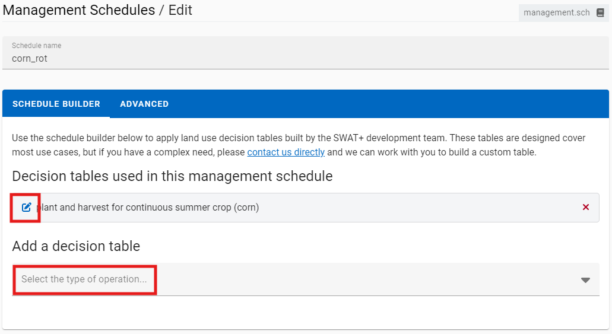

# Land Use Management

A primary goal of environmental modeling is to assess the impact of human activities on a given system. Central to this assessment is the itemization of the land and water management practices taking place within the system. This section contains input data for planting, harvest, irrigation applications, nutrient applications, pesticide applications, and tillage operations. Information regarding tile drains and urban areas is also stored in this file.

| SWAT+ Input File   | Database Table        |
| ------------------ | --------------------- |
| landuse.lum        | landuse\_lum          |
| management.sch     | management\_sch       |
|                    | management\_sch\_auto |
|                    | management\_sch\_op   |
| cntable.lum        | cntable\_lum          |
| ovn\_table.lum     | ovn\_table\_lum       |
| cons\_practice.lum | cons\_practice\_lum   |

In addition to the above, SWAT+ Editor groups the operations databases in this section of the editor. However, within the SWAT+ master watershed file (file.cio), these are listed under the ops section.

| SWAT+ Input File | Database Table |
| ---------------- | -------------- |
| graze.ops        | graze\_ops     |
| harv.ops         | harv\_ops      |
| irr.ops          | irr\_ops       |
| sweep.ops        | sweep\_ops     |
| fire.ops         | fire\_ops      |
| chem\_app.ops    | chem\_app\_ops |

## Land Use Management

This section is the entry point for management data in SWAT+. It comprises cross-walks to several other sections of data.

This data is accessed from the HRU properties section (hru-data.hru).

### landuse\_lum

| Field          | Type | Description                     | Related Table    |
| -------------- | ---- | ------------------------------- | ---------------- |
| id             | int  | Auto-assigned identifier        |                  |
| name           | text | Name of the land use properties |                  |
| cal\_group     | text | Calibration group               |                  |
| plnt\_com\_id  | int  | Plant community                 | plant\_ini       |
| mgt\_id        | int  | Management schedule             | management\_sch  |
| cn2\_id        | int  | Curve number                    | cntable\_lum     |
| cons\_prac\_id | int  | Conservation practices          | cons\_prac\_lum  |
| urban\_id      | int  | Urban land use                  | urban\_urb       |
| urb\_ro        | text | Urban runoff                    |                  |
| ov\_mann\_id   | int  | Overland flow Manning's n       | ovn\_table\_lum  |
| tile\_id       | int  | Tile drain                      | tiledrain\_str   |
| sep\_id        | int  | Septic tank                     | septic\_str      |
| vfs\_id        | int  | Filter strip                    | filterstrip\_str |
| grww\_id       | int  | Grassed waterway                | grassedww\_str   |
| bmp\_id        | int  | Best management practices       | bmpuser\_str     |
| description    | text | Optional description of the row |                  |

## Management Schedules

Management schedules comprise auto-schedules (decision tables) and/or operations schedules.

When you import your project from GIS, SWAT+ assigns auto-schedules for management based on your crop land use.

| Plant Type (in plants\_plt) | Decision Table Template |
| --------------------------- | ----------------------- |
| warm\_annual                | pl\_hv\_corn            |
| cold\_annual                | pl\_hv\_wwht            |
| perennial                   | no management schedule  |

For example, oats is a cold annual crop. If this crop is in your HRUs, a decision table named pl\_hv\_oats will be created based on the template of pl\_hv\_wwht when you import your data from GIS.

### Adding/Editing a Schedule

From the management schedules section, click create a new record or click edit on a row in the table. Give your schedule a unique name.

There are two modes within the editor: schedule builder and advanced. The schedule builder tab lets you easily customize existing decision table parameters in an easy-to-read format. Click the edit icon next to any existing tables in your schedule, or add a new one using the drop down at the bottom.

For most users we recommend using the schedule builder tab to select from decision tables built and tested by the model team. Advanced users can click the advanced tab and select automatic schedules or enter manual operations.

## Input Data Definitions

Refer to the [SWAT+ Documentation section on Landuse and Management](https://swatplus.gitbook.io/io-docs/introduction-1/landuse-and-management){ target="_blank"} for input column definitions and units. 