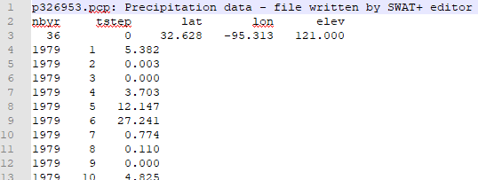

# Weather Stations

In SWAT+, weather stations are linked to your connection objects (channels, HRUs, etc.). Importing stations is strongly recommended over manual creation because SWAT+ Editor will automatically assign them to your connection objects based on nearest latitude and longitude. The Editor will also adjust your simulation dates to match the date range of your observed weather data.

## SWAT+ Format

Each measurement included in your data must have the following entry file names:

| Measurement       | Entry File |
| ----------------- | ---------- |
| Precipitation     | pcp.cli    |
| Temperature       | tmp.cli    |
| Solar radiation   | slr.cli    |
| Relative humidity | hmd.cli    |
| Wind speed        | wnd.cli    |

Each entry file has a title line (any text allowed), followed by a heading line, followed by a list of filenames for each station. Filenames should be listed alphabetically.

| pcp.cli: precipitation file names |
| --------------------------------- |
| filename                          |
| p326953.pcp                       |
| p326956.pcp                       |

Note: for tmp.cli, we recommend naming your station files with .tem extension instead of .tmp because sometimes Windows will auto-remove files with .tmp extensions thinking they are temporary files. Example:

| tmp.cli: temperature file names |
| ------------------------------- |
| filename                        |
| t326953.tem                     |
| t326956.tem                     |

Each station file has a title line, followed by a heading line and data line for time and location. Measurements for each timestep are in the lines to follow. For temperature, the measurements will be listed as max then min.

Download sample SWAT+ format weather files [here](https://plus.swat.tamu.edu/downloads/sample_files/weather-stations/swatplus-weather-stations.zip).

For hourly data format, see the [SWAT+ documentation](https://swatplus.gitbook.io/io-docs/introduction-1/climate/pcp.cli-and-precipitation-data-files).

## SWAT2012/Global Weather Websites Format

Each measurement included in your data must have the following entry file names:

| Measurement       | Entry File |
| ----------------- | ---------- |
| Precipitation     | pcp.txt    |
| Temperature       | tmp.txt    |
| Solar radiation   | solar.txt  |
| Relative humidity | rh.txt     |
| Wind speed        | wind.txt   |

Each entry file is a comma-separated list of stations. Each station name should have a corresponding .txt file (e.g., name p326-963 should have a p326-963.txt file).

| ID | Name     | Latitude | Longitude | Elevation |
| -- | -------- | -------- | --------- | --------- |
| 1  | p326-963 | 32.628   | -96.250   | 142.0     |

Each station file should have the first line as the starting day as YYYYMMDD (e.g., 19790101). The following lines are the measurement for each day, one line per day. For temperature, each line will be max,min (e.g., 10.138,-2.662). Please note: SWAT2012 format does not accept hourly data. Please use SWAT+ format described below for hourly weather files.

Global weather data options are available on the [SWAT website](https://swat.tamu.edu/data/){ target="_blank" }.

Download sample SWAT2012 / Global Data Websites format weather files [here](https://plus.swat.tamu.edu/downloads/sample_files/weather-stations/swat2012-weather-stations.zip).

## Missing Data

SWAT+ treats any value at below -97 as missing. The convention is to use -99 for any missing values.

## Check Encoding

Ensure the files you're importing are saved with UTF-8 encoding. Otherwise, you may get errors about reading the start date despite it appearing correctly formatted in your files.

You can open your files in Notepad++ and change the encoding via the Encoding menu in the top toolbar. It must be only UTF-8, not other variations.