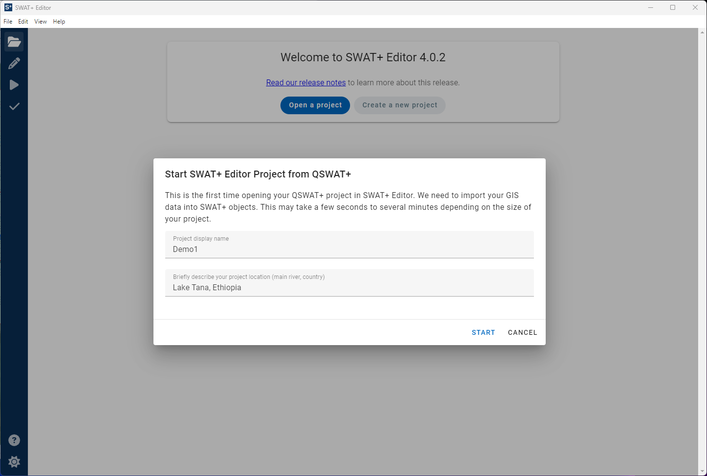
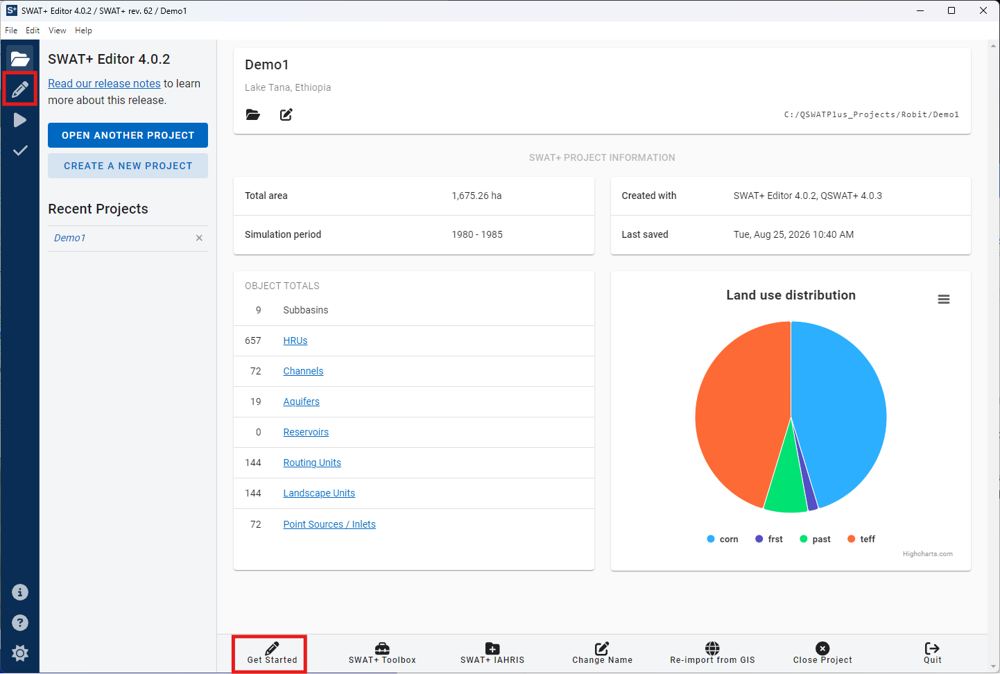

---
hide:
  - navigation
---

# Project Setup

When you open SWAT+ Editor, you are taken to the project setup screen. If you are coming from QSWAT+, an overlay will appear with the option to change your project display name and enter a brief description of your watershed. The description helps our modeling team diagnose issues you may encounter during the modeling process, so please don't skip this step.

When your project is done importing from GIS, it will be selected as your current project and displayed in the recent projects sidebar on the left as well as in the center screen.

From here you can start editing your SWAT+ inputs by clicking the "Get started" button at the bottom, or by clicking the pencil icon in the far left blue-colored menu.

## Using the editor without GIS

If you are not coming from QSWAT+, you may open the editor and create a new project from scratch. A project database will be created for you and you will need to input your spatial connections and all other data manually. This is not recommended.

## Download a Demo Project

[Download our example watershed project](https://plus.swat.tamu.edu/downloads/sample_files/editor-demos/robit_demo_4.0.zip) that has already completed steps 1 and 2 of QSWAT+ and is ready to open in SWAT+ Editor. WGN and weather files are included in the project folder.