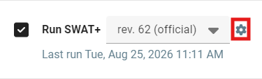

---
hide:
  - navigation
---

# Run SWAT+

The SWAT+ Editor version is coupled tightly with a major model revision. Due to potential model input and output changes, it is not recommended to use a different major version with the same editor install.

A major version number refers to the first number before the period. The second number is a minor version update and third is patch/bug fix. Example:

```
62.0.0
<major>.<minor>.<patch>
```

It would not be safe to use version 61.0.2 with the version of SWAT+ Editor packaged with 62.0.0. However, it is likely safe to use 62.0.1 or 62.1.0. Always refer to the release notes before attempting to use your own model executable with the editor.

The interface provided instructions for using your own model executable. Click the gear icon next to the SWAT+ version dropdown for more information.

